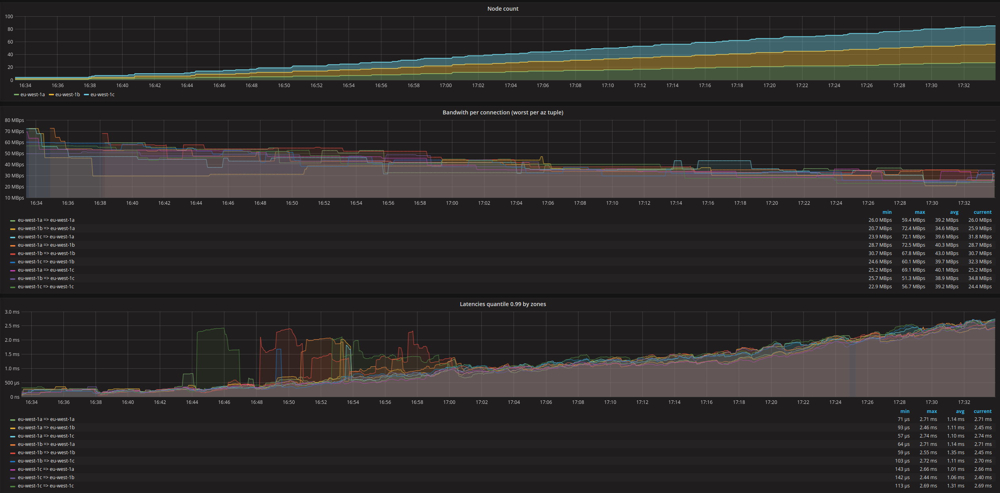

# kube-latency

This is a simple little tool, that helps to measure bandwidth and latency in a
kubernetes Pod Network.



## Tests

These tests are excuted on every Node (through a DaemonSet) every 10 seconds

* Test `/ping` all other Pods (5 times)
* Download `/data` (16MBytes) from one randomly selected node

The result of the tests is tagged with Zone, Node and Pod information and
scraped by Prometheus. The results can graphed using Grafana.

## Example test case

```
# Setup prometheues + kube-latency in cluster using helm
## prometheus runs on nodes that are labeled `role: monitoring`
## kube-latency runs on nodes that are labeled `role: worker`
helm upgrade --install --values contrib/test/kube-latency-values.yaml test-kl contrib/helm/kube-latency

# Setup grafana
helm upgrade --install --values contrib/grafana/helm-values.yaml grafana stable/grafana

# Port forwards
## prometheus localhost:9090
## grafana    localhost:9091
kubectl port-forward $(kubectl get pods --namespace default -l "app=prometheus,release=test-kl" -o jsonpath="{.items[0].metadata.name}") 9090:9090
kubectl port-forward $(kubectl get pods --namespace default -l "app=grafana-grafana,component=grafana" -o jsonpath="{.items[0].metadata.name}") 9091:3000

# Import Grafana's dashboard from contrib/grafana/kube-latency-dashboard.json.
The username and password for Grafana is admin.
```
